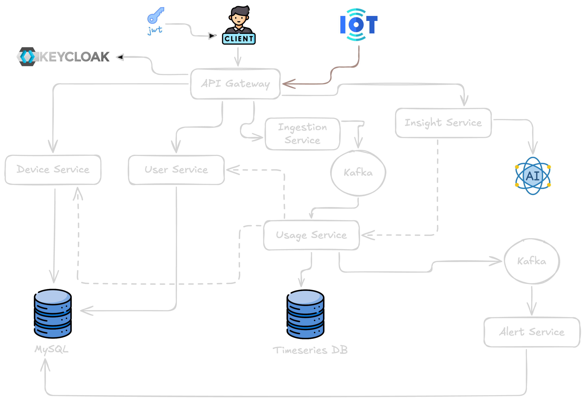

# Home Energy Tracker

A **microservices reference implementation** for monitoring and reasoning about household electricity usage. The system accepts energy readings from devices, processes them asynchronously, stores time-series metrics, raises alerts when usage spikes, and exposes a unified API through an **API Gateway** with **resilience**, **security**, and **observability** built in.

---

## Project overview

**Home Energy Tracker** models how a real product might collect **power (watts)** and **timestamps** from smart plugs or meters, aggregate that data for dashboards and billing-style views, and notify residents when consumption crosses thresholds.

**Problem it solves:** Raw device events are high-volume and need reliable ingestion, decoupled processing, and specialized storage (relational metadata vs. time-series measurements). This project demonstrates that split: HTTP APIs for users and devices, Kafka for event streaming, InfluxDB for usage series, and MySQL for durable domain data.

**Typical use cases:**

- Track **per-device** energy usage over time  
- **Alert** when instantaneous or aggregated power exceeds a limit  
- **Gate** all public HTTP traffic through one entry point (API Gateway) with JWT validation  
- **Observe** latency, errors, and circuit-breaker state with Prometheus and Grafana  

---

## Architecture overview

The system is a **microservices architecture** built primarily with **Spring Boot 4** and **Java 21**. Services are independently deployable modules; integration uses **synchronous HTTP** (client → gateway → service) and **asynchronous messaging** (Kafka) where loose coupling and scale matter.

**Patterns and capabilities:**

| Area | Approach |
|------|----------|
| **API Gateway** | Spring Cloud Gateway (Server MVC); single public HTTP façade, route aggregation, OpenAPI aggregation |
| **Service communication** | REST between gateway and backends; Kafka for ingestion → usage → alerts |
| **Resilience** | **Circuit breakers** (Resilience4j) on gateway routes with fallbacks |
| **Security** | **OAuth2 Resource Server** on the gateway; **Keycloak** for identity (dev profile in Docker Compose) |
| **Observability** | Spring Boot **Actuator**, **Micrometer**, **Prometheus** scrape targets, **Grafana** dashboards |
| **Configuration** | Per-service `application.properties` (no separate Spring Cloud Config Server in this repo) |

**High-level interaction:** Clients call the **API Gateway**. Domain services (**user**, **device**, **ingestion**, **insight**) sit behind it. **Ingestion** publishes to Kafka; **usage** consumes, writes to **InfluxDB**, and may publish **alerts**; **alert** consumes alerts and sends email (e.g. via **Mailpit** in local dev). **Insight** can provide AI-style summaries (Spring AI), routed through the gateway when enabled.

---

## Services breakdown

| Service | Port | Responsibility | Key technologies | Interactions |
|---------|------|------------------|------------------|--------------|
| **api-gateway** | `9000` | Public entry: routing, circuit breaking, JWT validation, aggregated API docs | Spring Boot 4, Spring Cloud Gateway (WebMVC), Resilience4j, OAuth2 Resource Server, springdoc | Proxies to user, device, ingestion, insight services; calls Keycloak JWKS |
| **user-service** | `8080` | User accounts and related persistence | Spring Boot 4, JPA, MySQL, Flyway, Actuator/Prometheus | MySQL; invoked via gateway |
| **device-service** | `8081` | Device registry / metadata | Spring Boot 4, JPA, MySQL, Actuator/Prometheus | MySQL; invoked via gateway |
| **ingestion-service** | `8082` | Accept energy readings over HTTP and publish to streaming pipeline | Spring Boot 4, Kafka producer, Actuator/Prometheus | Produces to Kafka (`energy-usage`); invoked via gateway or directly for tests |
| **usage-service** | `8083` | Consume usage events, time-series storage, aggregation / threshold logic | Spring Boot 4, Kafka consumer/producer, InfluxDB Java client, Actuator/Prometheus | Kafka ↔ InfluxDB; produces alert events for downstream consumers |
| **alert-service** | `8084` | Consume alert events, notify users (e.g. email) | Spring Boot 4, Kafka, JPA, Mail, MySQL, Actuator/Prometheus | Kafka consumer; SMTP (Mailpit locally); MySQL where applicable |
| **insight-service** | `8085` | Usage insights (e.g. LLM-backed explanations via Ollama) | Spring Boot 3.5, Spring AI, Ollama starter, Actuator/Prometheus | Invoked via gateway; optional external Ollama runtime |

### Full microservices flow

*End-to-end path: ingestion, messaging, usage processing, storage, alerting, and supporting services.*

  
*Figure: Full system walkthrough across components and data paths.*

---

## Tech stack

- **Language:** Java **21**  
- **Framework:** **Spring Boot 4** (domain services and gateway); **Spring Boot 3.5** + **Spring AI** (`insight-service`)  
- **Spring Cloud:** **2025.1.0** — Gateway (Server WebMVC), **Circuit Breaker** (Resilience4j)  
- **Messaging:** **Apache Kafka** (KRaft)  
- **Databases:** **MySQL 8** (relational data), **InfluxDB 2** (time-series usage)  
- **Identity (local dev):** **Keycloak**  
- **Email (local dev):** **Mailpit**  
- **Observability:** **Micrometer**, **Prometheus**, **Grafana**  
- **API documentation:** **springdoc-openapi** (gateway aggregates service OpenAPI URLs)  
- **Containerization:** **Docker** & **Docker Compose**  
- **Build:** **Maven** (each service includes `mvnw`)  

